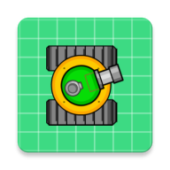

# CrazyTanks

[](https://github.com/shuai132/CrazyTanks/actions?workflow=Ubuntu)



坦克小游戏  
Powered by [Cocos2d-x](https://github.com/cocos2d/cocos2d-x)

声明：禁止用于商业用途。部分素材来源于网络，如有侵权请联系我删除。

### Clone

因包含submodule，克隆仓库请添加`--recursive`参数，或clone后执行：
```bash
git submodule update --init --recursive
```

## Build

1. PC端  
* macOS  
nothing to do
* Linux
```shell
./cocos2d/install-deps-linux.sh
```

使用CMake:
```shell
mkdir build && cd build && cmake .. && make
```
2. Android/iOS见各自工程
